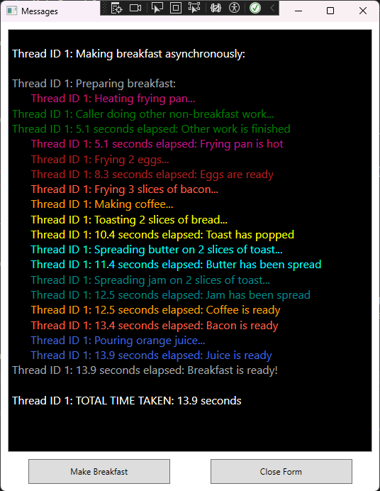

# AsyncWpfDEMO_Net8
A WPF application demonstrating async programming in C# and .NET 8.  It is loosely based on MS article "Asynchronous programming with async and await", https://learn.microsoft.com/en-us/dotnet/csharp/asynchronous-programming/.

This application demonstrates that a call to an asynchronous method, and the continuation of the calling code after the asynchronous method has completed, occur on the calling thread.  In other words, asynchronous methods run on the same thread as the main application.

The application has been rewritten in WPF from the original AsyncDEMO_Net8 console application: https://github.com/OneEyedSi/AsyncDEMO_Net8.  For more information about what the application does, see the AsyncDEMO_Net8 wiki home page: https://github.com/OneEyedSi/AsyncDEMO_Net8/wiki

The original console application contained various versions of the code.  This WPF application is a copy of just one of those versions: the asynchronous version that combines immediate and deferred awaits.  See the AsyncDEMO_Net8 wiki page for more details: https://github.com/OneEyedSi/AsyncDEMO_Net8/wiki/2.4.-Mixing-Immediate-And-Deferred-awaits.  The asynchronous methods in this application are almost identical to the console application methods, apart from writing the output to a WPF form instead of a console application.

## Execution
When the application runs each method called writes the ThreadId of the thread it's running on to the WPF form:

As you can see, all methods run on the same thread as the main application.